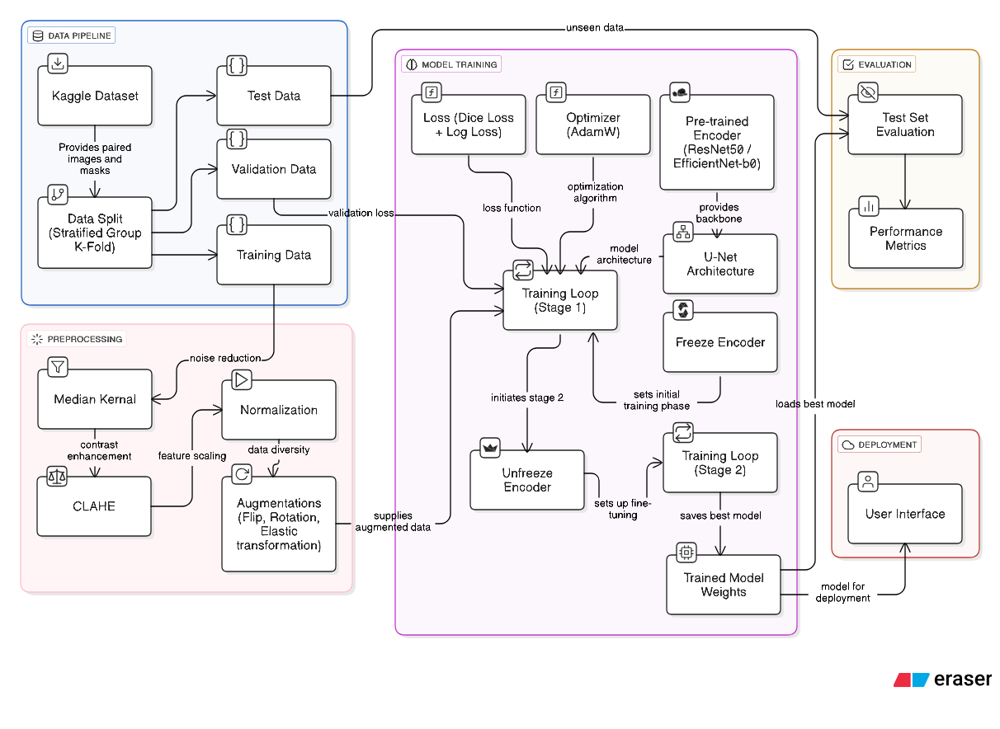

# Brain Tumor Segmentation from MRI Scans using Deep Learning


An end-to-end deep learning project for segmenting brain tumors from 2D MRI slices. This repository contains the full pipeline, from data analysis and preprocessing to model training, evaluation, and an interactive web demo.

***

## 📋 Project Overview

The primary goal of this project is to develop a robust AI tool to assist radiologists by automatically segmenting tumorous regions in brain MRI scans. By leveraging a **U-Net** architecture with pre-trained backbones, this project explores different configurations to achieve high accuracy, potentially leading to faster and more precise diagnoses.

### ✨ Key Features
* **Deep Learning Model:** Implements the **U-Net** architecture, a state-of-the-art model for biomedical image segmentation.
* **Comparative Analysis:** Trains and evaluates four model variants using **`ResNet50`** and **`EfficientNet-b0`** encoders, both with and without advanced image preprocessing techniques.
* **Advanced Preprocessing:** Includes optional image enhancement techniques like **Median Filtering** for noise reduction and **CLAHE** (Contrast Limited Adaptive Histogram Equalization) for improved contrast.
* **Robust Training:** Utilizes a two-stage fine-tuning strategy, a **Combo Loss** function (Dice + BCE), and a learning rate scheduler for stable and effective training.
* **Comprehensive EDA:** Features a detailed Exploratory Data Analysis to understand dataset characteristics, including tumor size, location, and intensity distributions.
* **Interactive Demo:** A simple and user-friendly web interface built with **Gradio** to allow for real-time inference on new MRI images.

***

## 💾 Dataset

This project uses the **[LGG MRI Segmentation Dataset](https://www.kaggle.com/datasets/mateuszbuda/lgg-mri-segmentation)** available on Kaggle.

* **Content:** Contains 3,929 MRI images from 110 patients with low-grade glioma.
* **Paired Data:** Each MRI slice is paired with a corresponding binary mask, manually annotated by experts to outline the tumor region.

***

## 🔬 Methodology

The project follows a systematic machine learning pipeline:

1.  **Data Splitting:** A **StratifiedGroupKFold** approach is used to split the data, ensuring that all slices from a single patient remain in the same set (train/val/test) to prevent data leakage and ensure fair evaluation as well as balancing classes ratio across all splits.
2.  **Preprocessing:** Images are first de-noised with a **Median Filter** and then their contrast is enhanced using **CLAHE**. This step is a key experiment variable.
3.  **Augmentation:** A rich pipeline of augmentations (flips, rotations, elastic transformations) is applied to the training data to improve model robustness and prevent overfitting.
4.  **Model Architecture:** A **U-Net** with a pre-trained encoder (`ResNet50` or `EfficientNet-b0`) is used for transfer learning.
5.  **Training:** The model is trained in two stages: first with the encoder frozen to train the decoder, and then with the entire network unfrozen for fine-tuning. A **`ComboLoss (Dice + BCE)`** function and **`ReduceLROnPlateau`** scheduler are used.
6.  **Evaluation:** Model performance is primarily measured by the **Dice Coefficient** and **Intersection over Union (IoU)** on the unseen test set, which are standard metrics for medical segmentation.


***

## 🚀 How to Use

### 1. Setup
* Clone the repository:
    ```bash
    git clone [https://github.com/Tada-TOT/Brain-Tumor-Segmentation-from-MRI-Scans-using-DL.git](https://github.com/Tada-TOT/Brain-Tumor-Segmentation-from-MRI-Scans-using-DL.git)
    ```
* Open the `SIC_Project_G9.ipynb` notebook in **Google Colab**.
* Download the **[LGG MRI Segmentation Dataset](https://www.kaggle.com/datasets/mateuszbuda/lgg-mri-segmentation)** from Kaggle and place it in the project directory within your Google Drive as specified in the notebook.

### 2. Running an Experiment
* The notebook is pre-configured to run all four experiments automatically. Simply run the cells from top to bottom.
* To run a single experiment, just skip `2.4 section`:
* The trained model weights for the best-performing model will be saved to your Google Drive.

***

## 📊 Results

This section will be updated with the final results from the four experiments. The automated experiment runner cell in the notebook generates a summary table with key metrics.

| Model | Dice Score | IoU Score | Accuracy Score | Precision Score | Recall Score | Best Val Loss |
| :--- | :--- | :--- | :--- | :--- | :--- | :---
| Preprocessed_ResNet50 | 0.886124 | 0.795531 | 0.996209 | 0.881243 | 0.891059 | 0.122466 |
| Raw_ResNet50 🔝| 0.889833 | 0.801531 | 0.996320 | 0.881961 | 0.897847 | 0.126476 |
| Preprocessed_EfficientNet-b0 | 0.880804 | 0.786997 | 0.996101 | 0.891450 | 0.870409 | 0.129262 |
| Raw_EfficientNet-b0 | 0.880718 | 0.786859 | 0.996181 | 0.911778 | 0.851704 | 0.140076 |

***

## 💡 Future Work

* **Advanced Architectures:** Experiment with more modern architectures like **Vision Transformers (ViT)** or **Attention U-Net** for improved performance.
* **MONAI Framework:** Integrate the **MONAI framework** to leverage its specialized tools and models pre-trained on large medical datasets, streamlining the development pipeline.
* **Different Preprocessing:** Explore more preprocessing filters such as Laplacian kernal and more edge detection filters.

***

## 👥 Team

* [Abdulghani Khayat/Team Leader]()
* [Abdullah Alasqah]()
* [Fahad Alshalawi]()
* [Jana Alaseeri]()
* [Zainab Alsadah]()
* [Mohammed Aljaddawi]()

***

## Acknowledgments

* This project was developed as part of the **Samsung Innovation Campus AI Program**.
* Dataset provided by [Mateusz Buda](https://www.kaggle.com/mateuszbuda) on Kaggle.
