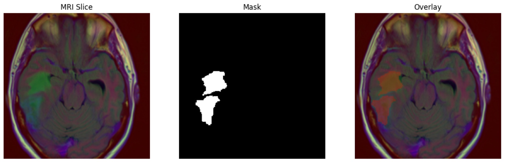
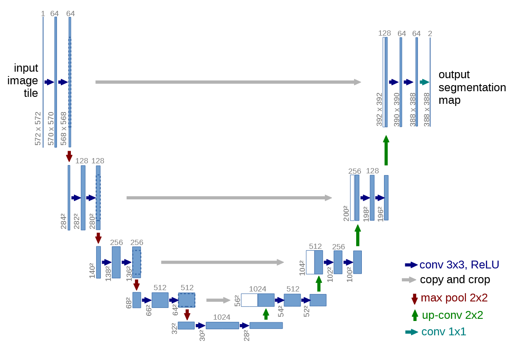
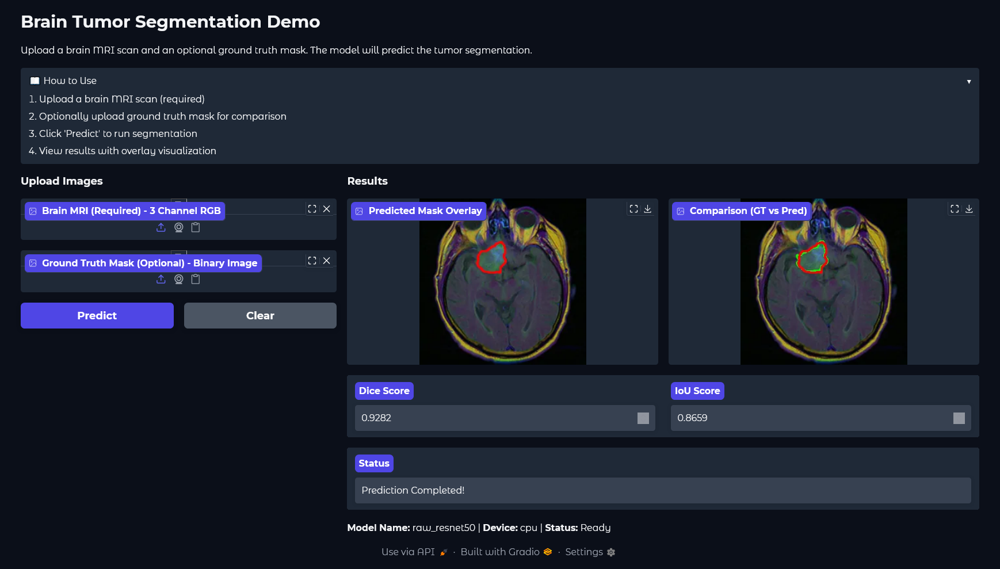
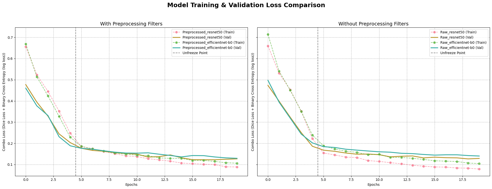

# Brain Tumor Segmentation from MRI Scans using Deep Learning


An end-to-end deep learning project for segmenting brain tumors from 2D MRI slices. This repository contains the full pipeline, from data analysis and preprocessing to model training, evaluation, and an interactive web demo.


<div align="center">
<b>Figure 1: Sample MRI scans showing tumor case with corresponding ground truth masks</b>
</div>

***

## 📋 Project Overview

The primary goal of this project is to develop a robust AI tool to assist radiologists by automatically segmenting tumorous regions in brain MRI scans. By leveraging a **U-Net** architecture with pre-trained backbones, this project explores different configurations to achieve high accuracy, potentially leading to faster and more precise diagnoses.

### ✨ Key Features
* **Deep Learning Model:** Implements the **U-Net** architecture, a state-of-the-art model for biomedical image segmentation.
* **Comparative Analysis:** Trains and evaluates four model variants using **`ResNet50`** and **`EfficientNet-b0`** encoders, both with and without advanced image preprocessing techniques.
* **Advanced Preprocessing:** Includes optional image enhancement techniques like **Median Filtering** for noise reduction and **CLAHE** (Contrast Limited Adaptive Histogram Equalization) for improved contrast.
* **Robust Training:** Utilizes a two-stage fine-tuning strategy, a composite loss function (Dice + BCE), and a learning rate scheduler for stable and effective training.
* **Comprehensive EDA:** Features a detailed Exploratory Data Analysis to understand dataset characteristics, including tumor size, location, and intensity distributions.
* **Interactive Demo:** A simple and user-friendly web interface built with **Gradio** to allow for real-time inference on new MRI images.

***

## 💾 Dataset

This project uses the **[LGG MRI Segmentation Dataset](https://www.kaggle.com/datasets/mateuszbuda/lgg-mri-segmentation)** available on Kaggle.

- **Volume**: 3,929 MRI images from 110 patients
- **Annotation**: Expert-annotated binary masks for tumor regions
- **Format**: TIFF images with corresponding mask files

### Dataset Statistics
| Metric | Value |
|--------|-------|
| Total Images | 3,929 |
| Patients | 110 |
| Tumor Positive | 2,556 (65.1%) |
| Tumor Negative | 1,373 (34.9%) |
| MRI Scan Size | 256 × 256 pixels x 3 channels |

***

## 🔬 Methodology

The project follows a systematic machine learning pipeline:

1.  **Data Splitting:** A **StratifiedGroupKFold** approach is used to split the data, ensuring that all slices from a single patient remain in the same set (train/val/test) to prevent data leakage and ensure fair evaluation as well as balancing classes ratio across all splits.
2.  **Preprocessing:** Images are first de-noised with a **Median Filter** and then their contrast is enhanced using **CLAHE**. This step is a key experiment variable.
3.  **Augmentation:** A rich pipeline of augmentations (flips, rotations, elastic transformations) is applied to the training data to improve model robustness and prevent overfitting.
4.  **Model Architecture:** A **U-Net** with a pre-trained encoder (`ResNet50` or `EfficientNet-b0`) is used for transfer learning.
5.  **Training:** The model is trained in two stages: first with the encoder frozen to train the decoder, and then with the entire network unfrozen for fine-tuning. A **`ComboLoss (Dice + BCE)`** function and **`ReduceLROnPlateau`** scheduler are used.
6.  **Evaluation:** Model performance is primarily measured by the **Dice Coefficient** and **Intersection over Union (IoU)** on the unseen test set, which are standard metrics for medical segmentation.


### Model Architecture

The U-Net architecture consists of:
- **Encoder**: Pre-trained CNN backbone (ResNet50 | EfficientNet-B0)
- **Decoder**: Symmetric expanding path with skip connections
- **Output**: Single-channel probability map with sigmoid activation


<div align="center">
<b>Figure 3: U-Net architecture with encoder-decoder structure and skip connections</b>
</div>

---

### Loss Function

We employ a composite loss function combining Dice Loss and Binary Cross-Entropy:

**Combo Loss**:

$$L_{\text{combo}} = L_{\text{dice}} + L_{\text{BCE}}$$

**Dice Loss**:

$$L_{\text{dice}} = 1 - \frac{2 \times |Y_{\text{true}} \cap Y_{\text{pred}}|}{|Y_{\text{true}}| + |Y_{\text{pred}}| + \varepsilon}$$

**Binary Cross-Entropy Loss**:

$$L_{\text{BCE}} = -\frac{1}{|Y_{\text{true}} \cup Y_{\text{pred}}|} \sum_{x \in Y_{\text{true}} \cup Y_{\text{pred}}} [y_x \log(p_x) + (1-y_x) \log(1-p_x)]$$

Where:
- $$Y_{\text{true}}$$: Ground truth binary mask
- $$Y_{\text{Pred}}$$: Predicted probability map
- $$ε = 1e-8$$: Smoothing factor to prevent division by zero
- $$y_x$$: The ground truth binary label at position/pixel x
- $$p_x$$: The predicted probability at position/pixel x 

---

### Evaluation Metrics

**Dice Coefficient (DSC)**:

$$\text{DSC} = \frac{2 \times \text{TP}}{2 \times \text{TP} + \text{FP} + \text{FN}}$$

**Intersection over Union (IoU)**:

$$\text{IoU} = \frac{\text{TP}}{\text{TP} + \text{FP} + \text{FN}}$$

**Pixel Accuracy**:

$$\text{Accuracy} = \frac{\text{TP} + \text{TN}}{\text{TP} + \text{TN} + \text{FP} + \text{FN}}$$

**Precision**:

$$\text{Precision} = \frac{\text{TP}}{\text{TP} + \text{FP}}$$

**Recall**:

$$\text{Recall} = \frac{\text{TP}}{\text{TP} + \text{FN}}$$

Where: $$TP$$ = True Positive, $$TN$$ = True Negative, $$FP$$ = False Positive, $$FN$$ = False Negative

---

### Data Preprocessing

**Image Enhancement Pipeline**:
1. **Median Filtering**: `3×3` kernel for noise reduction
2. **CLAHE**: Contrast Limited Adaptive Histogram Equalization
   - Clip limit: `3.0`
   - Tile grid size: `(8, 8)`
3. **Normalization**: ImageNet statistics (μ = `[0.485, 0.456, 0.406]`, σ = `[0.229, 0.224, 0.225]`)

**Data Augmentation**:
- Horizontal/Vertical flips `(p=0.5)`
- Random rotation `(±25°)`
- Elastic transformations

---

### Training Strategy

**Two-Stage Fine-tuning**:
1. **Stage 1** (`5` epochs): Frozen encoder, train decoder only
   - Learning rate: `1e-4`
   - Optimizer: `AdamW`
2. **Stage 2** (`15` epochs): Full network fine-tuning
   - Learning rate: `1e-5`
   - Optimizer: `AdamW`

**Learning Rate Scheduling**:
- ReduceLROnPlateau with `patience=3`, `factor=0.1`

***

## 🚀 How to Use

### Prerequisites
```bash
pip install torch torchvision
pip install segmentation-models-pytorch
pip install albumentations
pip install gradio
pip install opencv-python
pip install safetensors
```

### 1. Setup
* Clone the repository:
    ```bash
    git clone [https://github.com/Tada-TOT/Brain-Tumor-Segmentation-from-MRI-Scans-using-DL.git](https://github.com/Tada-TOT/Brain-Tumor-Segmentation-from-MRI-Scans-using-DL.git)
    ```
* Open the `SIC_Project_G9.ipynb` notebook in **Google Colab**.
* Download the **[LGG MRI Segmentation Dataset](https://www.kaggle.com/datasets/mateuszbuda/lgg-mri-segmentation)** from Kaggle and place it in the project directory within your Google Drive as specified in the notebook.

### 2. Running an Experiment
* The notebook is pre-configured to run all four experiments automatically. Simply run the cells from top to bottom.
* To run a single experiment, just skip `2.4 section`:
* The trained model weights for the best-performing model will be saved to your Google Drive.

### 3. Running the UI for testing
* Run `Phase 0: Environment Setup` and `Phase 3: User Interface`.
> You may need to edit `app.py` since it gets `best_model_raw_resnet50.safetensors` using hard coded path.


<div align="center">
<b>Figure 4: Interactive web interface for real-time tumor segmentation</b>
</div>

***

## 📊 Results

| Model Configuration | Dice Score ↑ | IoU Score ↑ | Accuracy ↑ | Precision ↑ | Recall ↑ | Val Loss ↓ |
|-------------------|------------|-----------|----------|-----------|--------|-----------|
| **Raw_ResNet50** 🏆 | **0.8898** | **0.8015** | **0.9963** | **0.8820** | **0.8978** | **0.1265** |
| Preprocessed_ResNet50 | 0.8861 | 0.7955 | 0.9962 | 0.8812 | 0.8911 | 0.1225 |
| Preprocessed_EfficientNet-B0 | 0.8808 | 0.7870 | 0.9961 | 0.8915 | 0.8704 | 0.1293 |
| Raw_EfficientNet-B0 | 0.8807 | 0.7869 | 0.9962 | 0.9118 | 0.8517 | 0.1401 |

### Key Findings

1. **Raw images** performed slightly better than preprocessed images across all encoder types
2. **ResNet50** outperformed EfficientNet-B0 in terms of Dice score and IoU
3. **Preprocessing impact** was minimal, suggesting the models can learn robust features from raw data, or the filters were not adequate
4. All models achieved **>88% Dice score**


<div align="center">
<b>Figure 5: Training and validation loss curves for all model configurations</b>
</div>

***

## 💡 Future Work

* **Advanced Architectures:** Experiment with more modern architectures like **Vision Transformers (ViT)** or **Attention U-Net** for improved performance.
* **MONAI Framework:** Integrate the **MONAI framework** to leverage its specialized tools and models pre-trained on large medical datasets, streamlining the development pipeline.
* **Different Preprocessing:** Explore more preprocessing filters such as Laplacian kernal and more edge detection filters.

***

## 👥 Team

* [Abdulghani Khayat/Team Leader]()
* [Abdullah Alasqah]()
* [Fahad Alshalawi]()
* [Jana Alaseeri]()
* [Zainab Alsadah]()
* [Mohammed Aljaddawi]()

***

## 📚 References

1. Ronneberger, O., Fischer, P., & Brox, T. (2015). U-NET: Convolutional Networks for Biomedical Image Segmentation. arXiv (Cornell University). https://doi.org/10.48550/arxiv.1505.04597
2. Siddique, N., Paheding, S., Elkin, C. P., & Devabhaktuni, V. (2021). U-Net and its Variants for Medical Image Segmentation: A Review of Theory and Applications. IEEE Access, 9, 82031–82057. https://doi.org/10.1109/access.2021.3086020
3. He, K., Zhang, X., Ren, S., & Sun, J. (2015). Deep residual learning for image recognition. arXiv (Cornell University). https://doi.org/10.48550/arxiv.1512.03385
4. Tan, M., & Le, Q. V. (2019). EfficientNet: Rethinking model scaling for convolutional neural networks. arXiv (Cornell University). https://doi.org/10.48550/arxiv.1905.11946

***

## Acknowledgments

* This project was developed as part of the **Samsung Innovation Campus AI Program**.
* Dataset provided by [Mateusz Buda](https://www.kaggle.com/mateuszbuda) on Kaggle.
